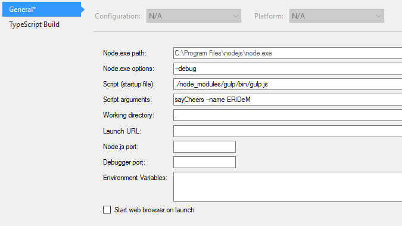

# Gulp KeepLearning

## Requirements

NodeJs and NPM can be installed via Chocolatey. Open PowerShell:

``
iex ((new-object net.webclient).DownloadString('https://chocolatey.org/install.ps1'))
``

Install Nodejs

``
choco install nodejs
``

## Installation

Install gulp command line utilities on your global.

``
gulp install -g gulp-cli
``

Install gulp on your project:

``
npm install gulp --save
``

And some interesting libraries:

``
npm install gulp-util del gulp-notify q through2 --save
``

## Snippets

Follow the snippets on the ``doc`` folder to create all examples.

## How to debug

Set up your VS project similar to the following example:



# Copyright

```

Copyright (c) 2016 Miguel Á. Domínguez Coloma

Permission is hereby granted, free of charge, to any person obtaining a copy of this software and associated documentation files (the "Software"), to deal in the Software without restriction, including without limitation the rights to use, copy, modify, merge, publish, distribute, sublicense, and/or sell copies of the Software, and to permit persons to whom the Software is furnished to do so, subject to the following conditions:

The above copyright notice and this permission notice shall be included in all copies or substantial portions of the Software.

THE SOFTWARE IS PROVIDED "AS IS", WITHOUT WARRANTY OF ANY KIND, EXPRESS OR IMPLIED, INCLUDING BUT NOT LIMITED TO THE WARRANTIES OF MERCHANTABILITY, FITNESS FOR A PARTICULAR PURPOSE AND NONINFRINGEMENT. IN NO EVENT SHALL THE AUTHORS OR COPYRIGHT HOLDERS BE LIABLE FOR ANY CLAIM, DAMAGES OR OTHER LIABILITY, WHETHER IN AN ACTION OF CONTRACT, TORT OR OTHERWISE, ARISING FROM, OUT OF OR IN CONNECTION WITH THE SOFTWARE OR THE USE OR OTHER DEALINGS IN THE SOFTWARE.

```